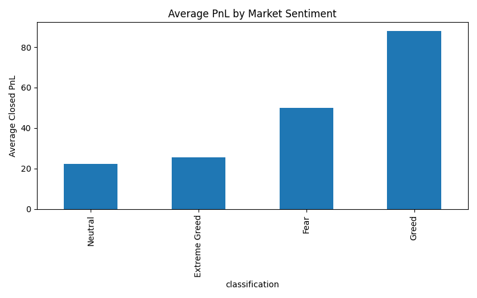
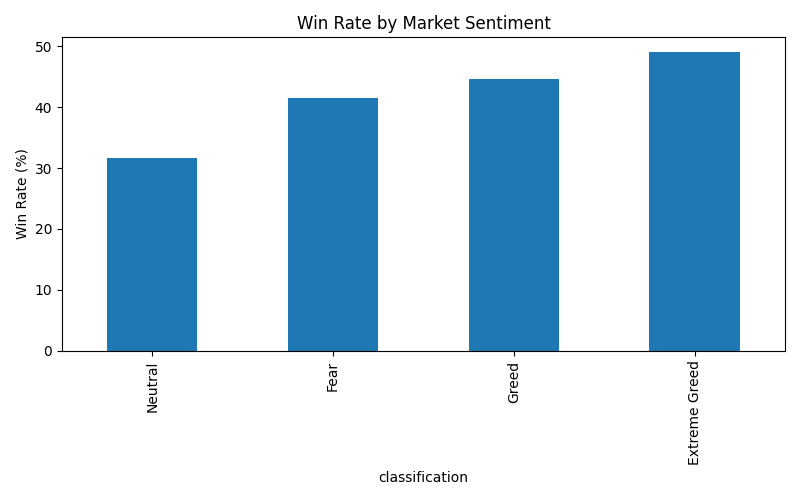
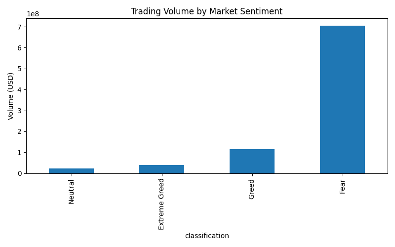

# Bitcoin Market Sentiment vs Trader Performance Analysis

## Installation

```bash
pip install -r requirements.txt
```

## Run

```bash
python analysis.py
```
## Objective

Analyze the relationship between Bitcoin market sentiment (Fear & Greed Index) and trader performance using Hyperliquid historical trading data.

## Datasets

- Fear & Greed Index Dataset
- Hyperliquid Historical Trader Dataset

## Methodology

1. Data Cleaning and Preprocessing
2. Date Standardization
3. Dataset Merging
4. Exploratory Data Analysis
5. Sentiment-Based Performance Analysis
6. Visualization

## Metrics Analyzed

- Average Closed PnL
- Total Profit and Loss
- Win Rate
- Trading Volume

## Key Findings

- Market sentiment has a measurable impact on trader performance.
- Different sentiment conditions produce different profitability patterns.
- Trading activity varies significantly across sentiment categories.
- Fear and Greed indicators can provide valuable context for trading decisions.

## Technologies Used

- Python
- Pandas
- Matplotlib
- Jupyter Notebook / VS Code

## Repository Structure

data/
notebooks/
images/
README.md
requirements.txt

## Conclusion

This analysis demonstrates how market sentiment influences trader behavior and profitability. Understanding sentiment trends can help improve trading strategies and risk management.

## Visualizations

### Average PnL by Market Sentiment



### Win Rate by Market Sentiment



### Trading Volume by Market Sentiment


